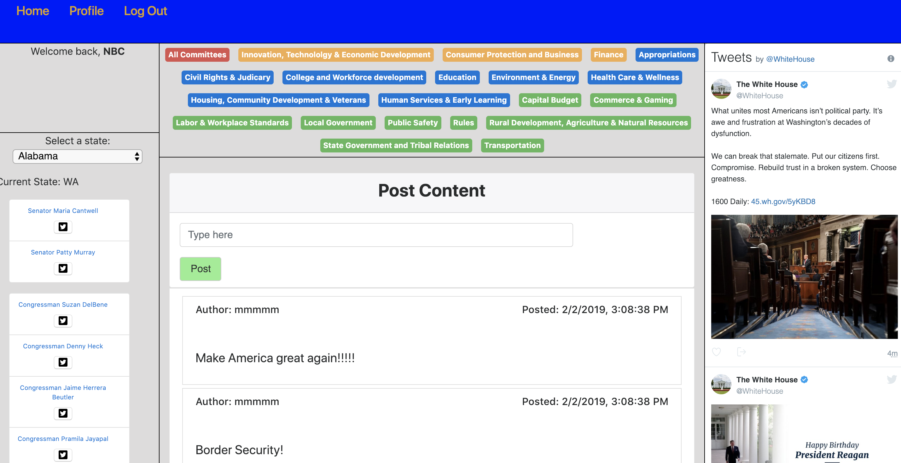

# Proper Channels (Political Networking App)

## Description
This MERN stack application allows users to create a profile and communicate with other users about issues within thier states or within political committees. 

## Demo

## Hosted:
Heroku: <https://proper-channels.herokuapp.com//>

## Technologies/Libraries Used:
* Node.js <https://nodejs.org/en/>
* Express <https://expressjs.com/>
* MongoDB / Mongoose: <https://www.mongodb.com/> <http://mongoosejs.com/>
* React.js <https://facebook.github.io/react/>
* PassportJS <http://www.passportjs.org/>
* Axios <https://github.com/mzabriskie/axios/>

## Project Members: 
### Kyle Conyers - <https://github.com/kyleconyers>
### Michael Panella - <https://github.com/MPPennella>
### Dmitrii Zakharov - <https://github.com/dmitrii4github>
### Craig Compton- <https://github.com/craigcompton>
### Nick Corrigan- <https://github.com/NBCorrigan>

